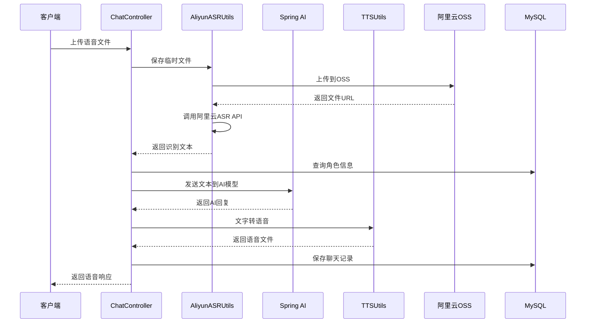

# AI语音聊天系统 - 项目架构文档

## 项目概述

**项目名称**: AIVoiceChat  
**技术栈**: Spring Boot 3.4.3 + Java 17 + MySQL + Redis + Spring AI  
**项目类型**: AI语音聊天系统  
**主要功能**: 支持多角色AI语音对话，集成语音识别(ASR)和语音合成(TTS)功能

## 系统架构

### 整体架构图

```
┌─────────────────────────────────────────────────────────────┐
│                    前端客户端 (Web/Mobile)                    │
└─────────────────────┬───────────────────────────────────────┘
                      │ HTTP/WebSocket
┌─────────────────────▼───────────────────────────────────────┐
│                Spring Boot 应用层                            │
│  ┌─────────────┐ ┌─────────────┐ ┌─────────────┐            │
│  │ Controller │ │   Service   │ │ Repository  │            │
│  │    层      │ │     层      │ │     层      │            │
│  └─────────────┘ └─────────────┘ └─────────────┘            │
└─────────────────────┬───────────────────────────────────────┘
                      │
┌─────────────────────▼───────────────────────────────────────┐
│                    核心功能模块                               │
│  ┌─────────────┐ ┌─────────────┐ ┌─────────────┐            │
│  │  语音识别   │ │  AI对话引擎  │ │  语音合成   │            │
│  │   (ASR)    │ │ (Spring AI) │ │   (TTS)    │            │
│  └─────────────┘ └─────────────┘ └─────────────┘            │
└─────────────────────┬───────────────────────────────────────┘
                      │
┌─────────────────────▼───────────────────────────────────────┐
│                    外部服务集成                               │
│  ┌─────────────┐ ┌─────────────┐ ┌─────────────┐            │
│  │  阿里云ASR  │ │  通义千问   │ │ UnifiedTTS  │            │
│  │   服务     │ │   AI模型    │ │   TTS服务   │            │
│  └─────────────┘ └─────────────┘ └─────────────┘            │
└─────────────────────┬───────────────────────────────────────┘
                      │
┌─────────────────────▼───────────────────────────────────────┐
│                    数据存储层                                 │
│  ┌─────────────┐ ┌─────────────┐ ┌─────────────┐            │
│  │    MySQL    │ │    Redis    │ │  阿里云OSS  │            │
│  │   (持久化)  │ │   (缓存)    │ │  (文件存储) │            │
│  └─────────────┘ └─────────────┘ └─────────────┘            │
└─────────────────────────────────────────────────────────────┘
```

## 核心模块规格

### 1. 控制器层 (Controller Layer)

#### 1.1 ChatController
- **功能**: 核心聊天控制器，处理语音聊天请求
- **主要接口**:
  - `POST /ai/voiceChat` - 语音聊天接口
- **职责**:
  - 接收用户语音文件
  - 调用语音识别服务
  - 处理AI对话逻辑
  - 调用语音合成服务
  - 返回语音响应

#### 1.2 CharacterController
- **功能**: 角色管理控制器
- **主要接口**:
  - 角色的增删改查操作
- **职责**:
  - 管理AI角色信息
  - 处理角色配置

#### 1.3 ChatSessionController
- **功能**: 聊天会话管理控制器
- **主要接口**:
  - 会话的创建、查询、删除
- **职责**:
  - 管理用户聊天会话
  - 维护会话状态

#### 1.4 ChatHistoryController
- **功能**: 聊天历史管理控制器
- **主要接口**:
  - 历史记录的查询和管理
- **职责**:
  - 管理聊天历史记录
  - 提供历史查询功能

#### 1.5 OssController
- **功能**: 文件上传管理控制器
- **主要接口**:
  - 文件上传到阿里云OSS
- **职责**:
  - 处理文件上传
  - 管理文件存储

### 2. 服务层 (Service Layer)

#### 2.1 CharacterService
- **功能**: 角色业务逻辑服务
- **实现类**: CharacterServiceImpl
- **职责**:
  - 角色信息的业务处理
  - 角色数据验证
  - 角色配置管理

#### 2.2 ChatSessionService
- **功能**: 聊天会话业务逻辑服务
- **实现类**: ChatSessionServiceImpl
- **职责**:
  - 会话创建和管理
  - 会话状态维护
  - 会话数据验证

### 3. 数据访问层 (Repository Layer)

#### 3.1 ChatHistoryRepository
- **功能**: 聊天历史数据访问接口
- **实现类**:
  - InMemoryChatHistoryRepository (内存实现)
  - RedisChatHistory (Redis实现)
- **职责**:
  - 聊天历史数据存储
  - 历史记录查询
  - 数据持久化

#### 3.2 Mapper层
- **CharacterMapper**: 角色数据映射
- **ChatSessionMapper**: 会话数据映射
- **职责**:
  - 数据库操作映射
  - SQL语句执行

### 4. 工具类模块 (Utils)

#### 4.1 AliyunASRUtils
- **功能**: 阿里云语音识别工具类
- **主要方法**:
  - `convertSpeechToText()` - 语音转文字
  - `uploadToOSS()` - 文件上传到OSS
  - `callAliyunASRAPI()` - 调用阿里云ASR API
- **特性**:
  - 支持多种音频格式 (WAV, MP3, AAC, FLAC, AMR, M4A)
  - 自动采样率适配
  - 异步任务处理
  - 完整的错误处理

#### 4.2 TTSUtils
- **功能**: 语音合成工具类
- **主要方法**:
  - `convertTextToSpeechByLiba()` - 文字转语音
  - `convertSpeechToTextIntelligent()` - 智能语音识别
- **特性**:
  - 支持多种TTS服务
  - 智能声道处理
  - 音频格式转换

#### 4.3 UnifiedttsUtils
- **功能**: 统一TTS服务工具类
- **主要方法**:
  - `textToSpeech()` - 文本转语音
- **特性**:
  - 集成UnifiedTTS API
  - 支持多种音色模型

#### 4.4 AudioConversionHelper
- **功能**: 音频格式转换工具
- **职责**:
  - 音频格式转换
  - 音频参数调整

#### 4.5 OssUtil
- **功能**: 阿里云OSS操作工具
- **职责**:
  - 文件上传下载
  - OSS配置管理

#### 4.6 VectorDistanceUtils
- **功能**: 向量距离计算工具
- **职责**:
  - 向量相似度计算
  - 距离算法实现

### 5. 配置模块 (Config)

#### 5.1 CommonConfiguration
- **功能**: 通用配置类
- **主要配置**:
  - ChatClient配置
  - ChatMemory配置
  - AI模型配置
- **特性**:
  - Spring AI集成
  - 聊天记忆管理
  - 日志记录

#### 5.2 MvcConfiguration
- **功能**: MVC配置类
- **职责**:
  - Web MVC配置
  - 跨域配置
  - 静态资源配置

#### 5.3 OssConfig
- **功能**: OSS配置类
- **职责**:
  - 阿里云OSS配置
  - 文件存储配置

### 6. 实体类模块 (Entity)

#### 6.1 DTO (Data Transfer Object)
- **Character**: 角色数据传输对象
  - 属性: id, name, description, image, promt, voiceModel, voice
- **ChatSession**: 聊天会话数据传输对象
  - 属性: chatId, chatName, characterId, creatTime

#### 6.2 PO (Persistent Object)
- **Msg**: 消息持久化对象
  - 消息数据存储

#### 6.3 VO (View Object)
- **MessageVO**: 消息视图对象
  - 前端展示数据

#### 6.4 Result
- **功能**: 统一响应结果类
- **职责**:
  - 统一API响应格式
  - 错误处理

## 数据库设计

### 主要数据表

#### 1. character表
```sql
CREATE TABLE `character` (
  `id` int NOT NULL AUTO_INCREMENT COMMENT '主键',
  `name` varchar(255) DEFAULT NULL COMMENT '姓名',
  `description` text COMMENT '角色描述',
  `image` varchar(255) DEFAULT NULL COMMENT '图片url',
  `promt` text COMMENT '角色提示词',
  `voice_model` varchar(255) DEFAULT NULL COMMENT '音色声音模型',
  `voice` varchar(255) DEFAULT NULL COMMENT '音色',
  PRIMARY KEY (`id`)
);
```

#### 2. chat_session表
```sql
CREATE TABLE `chat_session` (
  `chat_id` int NOT NULL AUTO_INCREMENT,
  `character_id` int DEFAULT NULL COMMENT '和人物的外键绑定',
  `creat_time` datetime DEFAULT NULL COMMENT '创建时间',
  `chat_name` varchar(25) NOT NULL COMMENT 'session名',
  PRIMARY KEY (`chat_id`, `chat_name`)
);
```

## 技术栈详情

### 后端技术栈
- **框架**: Spring Boot 3.4.3
- **Java版本**: Java 17
- **数据库**: MySQL 8.0.42
- **缓存**: Redis
- **ORM**: MyBatis Plus 3.5.7
- **AI框架**: Spring AI 1.0.0-M6
- **工具库**: Hutool 5.8.25
- **JSON处理**: Jackson 2.15.3

### 外部服务集成
- **AI模型**: 通义千问 (qwen-plus)
- **语音识别**: 阿里云智能语音交互
- **语音合成**: UnifiedTTS
- **文件存储**: 阿里云OSS

### 开发工具
- **构建工具**: Maven
- **代码生成**: Lombok
- **日志**: SLF4J + Logback

## 核心业务流程

### 语音聊天流程



## 部署架构

### 环境要求
- **JDK**: 17+
- **MySQL**: 8.0+
- **Redis**: 6.0+
- **内存**: 最小2GB，推荐4GB+
- **存储**: 最小10GB，推荐50GB+

### 配置文件
- **application.yaml**: 主配置文件
- **application-test.properties**: 测试环境配置

### 关键配置项
```yaml
spring:
  datasource:
    url: jdbc:mysql://localhost:3306/mou
    username: root
    password: 123456
  ai:
    openai:
      base-url: https://dashscope.aliyuncs.com/compatible-mode
      api-key: sk-xxx
      chat.options:
        model: qwen-plus
  data:
    redis:
      host: 192.168.150.101

unifiedtts:
  api:
    base-url: https://unifiedtts.com
    key: tts_xxx

aliyun:
  oss:
    endpoint: oss-cn-hangzhou.aliyuncs.com
    access-key-id: LTAI5txxx
    access-key-secret: vfkHZxxx
    bucket-name: kczx-interview
```

## 性能优化

### 缓存策略
- **Redis缓存**: 聊天历史、会话状态
- **内存缓存**: 角色信息、配置信息

### 异步处理
- **语音识别**: 异步任务处理
- **文件上传**: 异步上传到OSS
- **AI对话**: 流式响应

### 资源管理
- **临时文件**: 自动清理机制
- **连接池**: 数据库连接池优化
- **内存管理**: JVM参数调优

## 安全考虑

### 数据安全
- **敏感信息**: 配置文件加密
- **API密钥**: 环境变量管理
- **文件权限**: OSS访问控制

### 接口安全
- **参数验证**: 输入参数校验
- **文件类型**: 文件格式验证
- **大小限制**: 文件大小控制

## 监控和日志

### 日志配置
- **级别**: DEBUG (开发环境)
- **框架**: SLF4J + Logback
- **输出**: 控制台 + 文件

### 监控指标
- **性能指标**: 响应时间、吞吐量
- **业务指标**: 聊天次数、成功率
- **系统指标**: CPU、内存、磁盘

## 扩展性设计

### 水平扩展
- **无状态设计**: 支持多实例部署
- **负载均衡**: 支持负载均衡器
- **数据库**: 支持读写分离

### 功能扩展
- **多AI模型**: 支持多种AI模型
- **多TTS服务**: 支持多种语音合成
- **多语言**: 支持多语言识别

## 开发规范

### 代码规范
- **命名规范**: 驼峰命名法
- **注释规范**: JavaDoc标准
- **异常处理**: 统一异常处理

### 版本控制
- **Git**: 版本控制
- **分支策略**: Git Flow
- **提交规范**: Conventional Commits

## 测试策略

### 单元测试
- **覆盖率**: 核心业务逻辑80%+
- **框架**: JUnit 5
- **Mock**: Mockito

### 集成测试
- **API测试**: REST API测试
- **数据库测试**: 数据访问测试
- **外部服务**: Mock外部服务

## 维护和运维

### 日常维护
- **日志监控**: 定期检查日志
- **性能监控**: 监控系统性能
- **数据备份**: 定期数据备份

### 故障处理
- **错误码**: 统一错误码体系
- **告警机制**: 异常告警
- **恢复策略**: 故障恢复流程

---

**文档版本**: v1.0  
**最后更新**: 2025年1月  
**维护人员**: 开发团队
